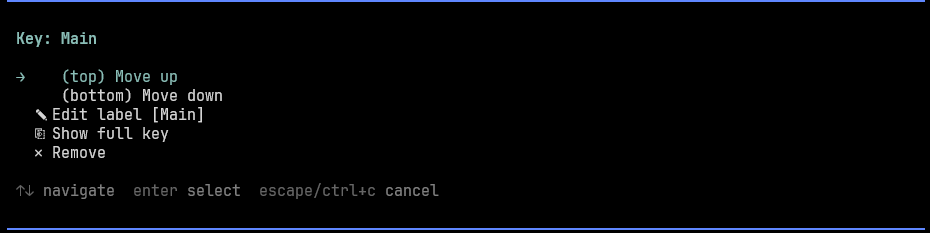

# pi-web-search

Web search extension for [pi](https://pi.dev) using the [Exa](https://exa.ai) API with automatic multi-key fallback on rate limits.


## Features

- **`web_search` tool** — search the web directly from pi conversations
- **Multi-key support** — rotate through multiple Exa API keys automatically
- **Rate limit handling** — keys auto-cooldown for 60s on 429, fallback to next key
- **`/exa` command** — interactive TUI to manage keys (add, remove, reorder, edit labels)

## Install

```bash
pi install git:github.com/QMahyar/pi-web-search
```

Or add to `~/.pi/agent/settings.json`:

```json
{
  "packages": ["git:github.com/QMahyar/pi-web-search"]
}
```

Then restart pi or run `/reload`.

## Setup

1. Get an API key from [exa.ai](https://exa.ai) → Settings → API Keys
2. Run `/exa` in pi to open the key manager
3. Select **"+ Add new key"** and paste your key
4. Optionally add a label (e.g. "personal", "work")

You can add multiple keys — if one hits a rate limit, the next is tried automatically.

## Usage

### web_search tool

The agent will automatically call `web_search` when it needs current information:

```
web_search(query: "latest pi coding agent features")
web_search(query: "exa api documentation", numResults: 3, recencyFilter: "week")
```

Parameters:
| Parameter | Type | Description |
|-----------|------|-------------|
| `query` | string | Search query (required) |
| `numResults` | integer | Number of results, 1-10 (default: 5) |
| `recencyFilter` | string | `day`, `week`, `month`, or `year` |

### /exa command

Interactive TUI for key management:



```
/exa
```

- **View keys** — see all configured keys with masked display
- **Add key** — paste API key, optionally add a label
- **Reorder** — move keys up/down in priority
- **Edit label** — rename key labels
- **Show full key** — display unmasked key
- **Remove** — delete a key with confirmation

## Config

Keys are stored in `~/.pi/web-search.json`:

```json
{
  "keys": [
    { "key": "exa_abc123...", "label": "personal" },
    { "key": "exa_def456...", "label": "work" }
  ]
}
```

## Why Exa?

- **No tracking** — Exa doesn't track search queries
- **High quality** — neural search with good relevance
- **Generous free tier** — 1000 searches/month on free plan
- **Fast** — typical response time < 500ms

## License

MIT
